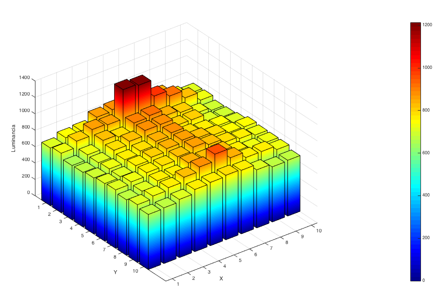
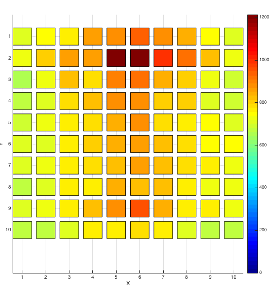

## Detección de actividad en una fuente de emisión Gamma (γ)

Scripts en Octave que realizan el procesamiento de imágenes obtenidas por un CMOS expuesto a dos fuentes de emisión gamma. El objetivo de este trabajo fue realizar una serie de pruebas para obtener la actividad de dos fuentes conocidas a partir de exponer una cámara fotográfica detrás de un centellador gamma. 

Las siguientes figuras muestran el resultado del las experiencias realizadas. El centellador era básicamente un conjunto de  10x10 cristales de 5mmx5mm cada uno. En este contexto el algoritmo realiza la segmentación de los cristales y luego obtiene el valor de actividad en cada uno de ellos, con el objetivo de identificar picos de alta energía (centroides).

